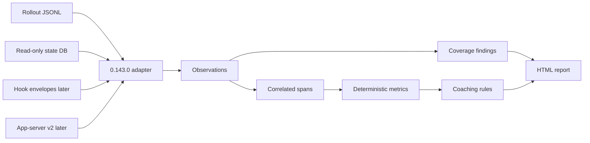

# Codex Observability: Research-to-Build Process

> The source-grounded process used to implement Codex Observability v0.2. The working plugin lives in [codex-observability](./codex-observability/).

## Recommendation in one sentence

Version 0.2 is a **local-only, read-only historical importer that produces self-contained bento dashboards and evidence-backed session coaching**. Trusted hooks, an MCP server, and an app-server client remain deferred until the offline product proves they are necessary.

That ordering matters. The local rollout is the best recovery and reconciliation source available for completed sessions, while hooks provide useful real-time context but should not be treated as complete capture. The app-server is powerful, but it adds a live-client lifecycle and a broader compatibility surface before the core product has been validated.

## Verified research snapshot

Research and v0.2 verification date: July 16, 2026.

| Item | Verified value | Consequence |
| --- | --- | --- |
| Installed CLI | `codex-cli 0.143.0` | Version 0.143.0 is the initial compatibility target. |
| Matching official source tag | `rust-v0.143.0` | Research and fixtures should use this tag, not `main`. |
| Matching source commit | `c4d748f586a84a3ed5b6aceb82e9a1db4abb1cda` | Record this commit in every 0.143.0 adapter and report. |
| Required source path | `/codex` | It is currently absent, so implementation is blocked by the project's own source-of-truth rule. |
| Temporary research checkout | Official `openai/codex` repository under `/private/tmp` | It is evidence for this document only, not the plugin's runtime source root. |

The official repository publishes a matching release tag, and the local runtime reports 0.143.0. Before implementation, clone or check out that exact tag at `/codex`, then verify that `/codex` resolves to the commit above. Do not build an adapter from the current `main` branch and assume it applies to 0.143.0.

## What the source establishes

The following files in the version-matched source are the initial engineering map:

| Concern | Source area | Finding |
| --- | --- | --- |
| Canonical persisted session stream | `codex-rs/rollout/src/recorder.rs` | Codex persists rollout items as JSONL for replay and inspection. The reader tolerates malformed lines, so the plugin must report partial parsing rather than fail the whole session silently. |
| Event and rollout model | `codex-rs/protocol/src/protocol.rs` | Defines session metadata, turn context, event messages, token usage, tool lifecycle events, approvals, patches, MCP calls, hooks, compaction, plans, and collaboration events. |
| Hook payloads | `codex-rs/hooks/src/schema.rs` | Hook inputs can contain prompts, tool inputs, tool responses, transcripts, and last assistant messages. These are sensitive and must not be stored by default. |
| Historical thread index | `codex-rs/state/migrations/*.sql` | The state database tracks rollout paths, source, model/provider, workspace, token total, archive state, version, reasoning effort, previews, history mode, and parent-child spawn edges as the schema evolves. |
| Skill detection | `codex-rs/core-skills/src/invocation_utils.rs` and `codex-rs/core/src/skills.rs` | Codex detects some implicit skill use from recognized skill-file or skill-script access and sends it to extension contributors and analytics. That does not prove the same fact is persisted in the user's rollout. |
| Plugin manifest | `codex-rs/core-plugins/src/manifest.rs` | In 0.143.0, the manifest parser accepts skills, MCP servers, apps, hooks, and interface metadata. Hook configuration can be a path, list of paths, or inline configuration. |
| Live protocol | `codex-rs/app-server-protocol/src/protocol/v2/*` | V2 exposes versioned thread, turn, item, hook, skill, plugin, and other schemas. Source guidance says active app-server development belongs in v2. |

Official product guidance also warns that hook transcript format is not stable. Therefore, `transcript_path` is a locator for a versioned adapter, not a timeless public schema. See [Codex hooks](https://learn.chatgpt.com/docs/hooks), [Codex app-server](https://learn.chatgpt.com/docs/app-server), and the [official Codex repository](https://github.com/openai/codex).

## The MVP contract

### Supported

- Every retained active and archived session, analyzed on demand
- Exact separation of top-level, spawned, and internal review threads
- Codex CLI 0.143.0 only
- Read-only access to local state and rollout sources
- A sanitized incremental cache under the plugin-owned data directory
- A responsive all-history bento dashboard and chronological session reports
- Metadata-first redaction
- Exact provenance for every reported fact
- Tool, approval, error, retry, compaction, subagent, plan, and token events when present
- Up to three deterministic positive highlights and improvement suggestions
- A coverage section listing missing, malformed, unsupported, or contradictory records
- No retained prompts, responses, titles, commands, complete paths, or raw tool output

### Deferred

- Live hooks
- A local MCP server
- An app-server client
- Cloud sync or team analytics
- Background or automatic collection
- Cross-version parsing beyond 0.143.0
- Model-generated scoring or a single productivity score
- Cost estimates

### Explicitly out of scope

- Private chain-of-thought
- Secret collection
- Silent telemetry upload
- Claims that tool volume, token volume, or session duration prove quality
- Attribution of a tool call to a skill without direct evidence

## Canonical data model

Use an append-only observation model. Derived facts should reference observations rather than overwrite them.

Minimum entities:

- `Session`: identity, source, CLI version, source commit, workspace, model, start/end status.
- `Turn`: turn identity, session identity, context snapshot, completion status.
- `Observation`: timestamp, ordinal, raw event type, source locator, parser version, redaction class.
- `Span`: correlated start/end operation, parent, duration, status, tool or hook name.
- `UsageSnapshot`: cumulative input, cached input, output, reasoning output, and total tokens.
- `Evidence`: a stable pointer to the source record supporting a fact or recommendation.
- `CoverageFinding`: severity, source, missing/unsupported/malformed condition, user impact.
- `Recommendation`: rule ID, evidence IDs, explanation, next action, confidence, feedback state.

Preserve the original event type and ordinal. Do not force every source record into a span; unmatched starts and ends are important coverage findings.

## Data coverage matrix

Create this matrix before implementing a metric. A metric cannot ship until its primary source, fallback, and failure behavior are defined.

| Fact | Primary source | Reconciliation source | Required caveat |
| --- | --- | --- | --- |
| Session identity and rollout path | State database | Rollout `SessionMeta` | Mismatches are a warning, never silently joined. |
| Turn boundaries and context | Rollout items | App-server later | Some interrupted turns may lack a normal completion event. |
| Tool lifecycle | Rollout event messages | Hooks later | Coverage depends on the tool and runtime version. |
| Tool payload content | None by default | Explicit opt-in only | Arguments and outputs may contain secrets and source code. |
| Token usage | Final cumulative rollout snapshot | Thread total in state DB | Do not sum cumulative snapshots. |
| Approvals and sandbox decisions | Rollout event messages | Permission hooks later | Absence of an event is not proof that no policy applied. |
| Compaction | Rollout/event messages | Pre/PostCompact hooks later | Content before compaction may be intentionally summarized. |
| Subagent graph | Collaboration events | State spawn-edge table | Missing child data must remain visible. |
| Skill availability | Turn/session skill metadata where exposed | App-server skills list later | Availability is not invocation. |
| Explicit skill request | User-visible request metadata or safe content opt-in | None | Metadata-only mode may make this unavailable. |
| Implicit skill detection | Extension/analytics path in source | File/script access heuristic | It is not yet proven to be a stable persisted rollout event. Label inference. |
| File changes | Patch and command events | Git diff, only with user authorization | A command mentioning a file does not prove a durable change. |
| Verification | Observed test/build/lint commands and results | None | The plugin can prove a check ran, not that every relevant check ran. |

Current upstream issue reports describe incomplete PreToolUse/PostToolUse coverage for some tool families. Treat those reports as a risk to test against the version-matched source and fixtures, not as a substitute for source inspection: [tool-hook coverage report](https://github.com/openai/codex/issues/20204) and [hook-parity tracker](https://github.com/openai/codex/issues/21753).

## Build process with engineering gates

### Gate 0: Lock the compatibility target

Actions:

1. Make the official source available at `/codex`.
2. Check out `rust-v0.143.0`.
3. Verify commit `c4d748f586a84a3ed5b6aceb82e9a1db4abb1cda`.
4. Record the local `codex --version` output.
5. Create a compatibility record containing CLI version, source tag, commit, adapter version, and generated-schema hash.

Exit criteria:

- The runtime and source match exactly.
- The plugin fails closed with a clear unsupported-version result when they do not match.
- All later research notes point to exact source files and symbols.

### Gate 1: Threat model and privacy contract

Classify every candidate field before parsing it:

- Public metadata
- Local-sensitive metadata, such as paths and repository names
- Content, such as prompts, responses, diffs, tool inputs, and tool outputs
- Secrets, such as credentials, tokens, cookies, and environment values

Default policy:

- Persist public and necessary local-sensitive metadata only.
- Hash or tokenize user paths in retained analytics.
- Keep raw content in memory only long enough to redact or derive an allowed fact.
- Never store raw hook payloads by default.
- Do not send session data to a model or network service without a separate, explicit user action.

Exit criteria:

- A field-level collection table exists.
- Retention, export, and deletion behavior is specified.
- Secret-shaped fixtures demonstrate that reports and logs do not leak values.

### Gate 2: Freeze the 0.143.0 source map

For each required fact, record:

- Source file and symbol
- Wire or persisted field name
- Whether it is stable, internal, or inferred
- Correlation keys
- Redaction class
- Expected failure modes
- Fixture covering the behavior

Generate app-server v2 schemas from the matching source for research and comparison, even though the MVP will not use a live app-server client. The official app-server documentation describes `codex app-server generate-json-schema` and `generate-ts`; generated schemas should be treated as versioned artifacts, not handwritten contracts.

Exit criteria:

- Every MVP report field maps to evidence.
- Unknown event types are preserved and surfaced.
- Skill states remain separate: available, requested, loaded, detected, and inferred adherence.

### Gate 3: Build the offline importer first

Implementation order for the future coding phase:

1. Select a thread from the read-only state index.
2. Resolve its rollout path without scanning unrelated session content.
3. Stream JSONL one line at a time.
4. Parse recognized records with the 0.143.0 adapter.
5. Preserve unknown records as opaque observations.
6. Record malformed lines with timestamp/ordinal context where possible.
7. Correlate start/end records without discarding incomplete spans.
8. Reconcile the final cumulative token snapshot with the state index.
9. Redact before rendering, logging, or persistence.

Exit criteria:

- One real, opt-in session produces a correct report.
- A malformed line does not erase the rest of the report.
- The importer makes no writes to Codex-owned data.
- Running the importer twice produces the same normalized result.

### Gate 4: Prove the report before coaching

Report order:

1. Outcome and completion confidence
2. Coverage and compatibility warnings
3. Timeline
4. Tool, approval, token, compaction, and subagent summaries
5. Artifacts and verification observed
6. Coaching suggestions
7. Provenance appendix

Coaching rules must be deterministic in the MVP. Each rule needs:

- A narrow observed pattern
- Required evidence
- Exclusions that suppress false positives
- One concrete next action
- A confidence level
- A test showing when it must not fire

Good first rules:

- A requested code change completed with no observed relevant verification.
- The same command failed repeatedly before a successful alternative.
- A permission request was broader than the succeeding operation required.
- Repeated repository-specific correction suggests durable `AGENTS.md` guidance, but only after cross-session support exists.

Exit criteria:

- No generic advice is emitted without session evidence.
- At most three suggestions appear.
- Every suggestion links to evidence and can be dismissed.

### Gate 5: Package the smallest plugin

Only after Gates 0–4 pass should implementation be packaged as a Codex plugin. The initial package should contain:

- `.codex-plugin/plugin.json`
- One skill for analyzing a selected session
- Local scripts for import, normalization, redaction, and HTML rendering
- Documentation and fixtures
- No hook, MCP server, or app-server client

Use the current plugin scaffold and validator rather than constructing the manifest from memory. The 0.143.0 source accepts a `hooks` manifest field, even though helper validation rules may lag; source-version compatibility tests decide what ships. [Build Codex plugins](https://learn.chatgpt.com/docs/build-plugins) is the public packaging reference.

Exit criteria:

- The manifest validates against the installed version.
- The skill gives Codex an explicit, auditable workflow.
- A newly installed or updated plugin is tested in a new Codex task, because plugin capabilities are loaded at task startup.

### Gate 6: Add trusted hooks as enrichment

Add hooks only after offline reports are correct. Start with the smallest useful set:

- `SessionStart` for session envelope and compatibility checks
- `PreToolUse` and `PostToolUse` for latency or status enrichment where supported
- `PermissionRequest` for permission timing and decisions
- `PreCompact` and `PostCompact` for context lifecycle
- `SubagentStart` and `SubagentStop` for live agent envelopes
- `Stop` for final reconciliation trigger

Store identifiers, timestamps, event names, tool names, status, and safe sizes by default—not raw prompts, tool arguments, responses, transcripts, or final messages.

Exit criteria:

- The plugin explains every hook and trust implication before activation.
- Disabling hooks still leaves offline analysis functional.
- Duplicate hook and rollout observations reconcile idempotently.
- A hook-coverage test matrix identifies tools that do not emit the expected events.

### Gate 7: Add rich live mode only if users need it

An app-server v2 client becomes worthwhile when users need a live timeline, not merely a post-session report. If added:

- Generate schemas from the exact source version.
- Treat thread, turn, and item IDs as correlation keys.
- Reconnect and reconcile against persisted rollouts.
- Test backpressure, dropped notifications, cancellations, and resume behavior.
- Keep app-server capture optional; the plugin must still explain its coverage when the client was not running.

An MCP server is justified only when multiple skills or external clients need structured queries over the normalized store. It is not required to prove the MVP.

### Gate 8: Release discipline

Before each release:

1. Add an adapter for the new Codex version rather than editing old behavior in place.
2. Diff the protocol, rollout recorder, hooks schema, state migrations, core-skills detection, plugin manifest, and app-server v2 schemas.
3. Run compatibility and privacy fixtures.
4. Produce a migration and coverage note.
5. Bump the plugin version and marketplace cache-buster together.
6. Install the built artifact and verify it in a fresh Codex task.

## Test plan

Minimum fixture set:

- Normal completed turn with a successful tool call
- Failed tool call followed by recovery
- Missing tool end event
- Malformed JSONL line between valid records
- Unknown future event type
- Cumulative token snapshots that would double-count if summed
- Permission requested, denied, and later retried safely
- Context compaction
- Parent session with one or more subagents
- Interrupted or cancelled turn
- Explicit skill request
- Implicit skill-file/script access without a stable persisted invocation event
- Hook disabled
- Runtime/source version mismatch
- Prompt, command, output, diff, and environment data containing test secrets
- Same input parsed twice with byte-equivalent normalized output
- Golden HTML report with stable provenance locators

Release-blocking invariants:

- No write occurs under Codex-owned state or rollout paths.
- No secret value appears in report output, logs, fixtures, or retained data.
- Unknown or malformed records lower coverage instead of disappearing.
- Every recommendation has evidence.
- Unsupported versions fail closed.

## Locked v0.2 product decisions

- Configurable `CODEX_SOURCE_ROOT`, defaulting to `/codex`, with a hard error when absent or mismatched
- CLI-only 0.143.0 MVP
- Analyze all retained sessions on demand and support a selected-session report
- Redacted reports plus a metadata-only sanitized history cache
- Self-contained responsive bento HTML before any app framework
- Deterministic coaching before model-assisted synthesis
- Constructive green and red cards with evidence, confidence, and capped output
- Luna for clear repeatable signatures, Terra for everyday/read-heavy exploration, and Sol for complex open-ended signatures
- Hooks as optional enrichment in the second milestone
- App-server and MCP deferred

This scope is intentionally narrow enough to validate the hardest promises: accuracy, provenance, privacy, version awareness, and useful coaching.

## Primary references

- [OpenAI Codex source](https://github.com/openai/codex)
- [Codex 0.143.0 release tag](https://github.com/openai/codex/tree/rust-v0.143.0)
- [Build Codex plugins](https://learn.chatgpt.com/docs/build-plugins)
- [Codex lifecycle hooks](https://learn.chatgpt.com/docs/hooks)
- [Codex app-server](https://learn.chatgpt.com/docs/app-server)
- [Build Codex skills](https://learn.chatgpt.com/docs/build-skills)
