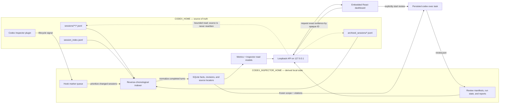

# Codex Inspector

**Local-first observability for Codex.** Codex Inspector turns the sessions
already in your Codex home into a dashboard for token usage, agent delegation,
source-backed session inspection, and evidence-grounded effectiveness reviews.

It runs on your machine, reads your existing Codex history, and serves a local
dashboard. There is no account, hosted service, remote database, or sample
dataset to configure.

> [!NOTE]
> The Build Week release supports **macOS on Apple Silicon (arm64)** and the
> tested current Codex rollout format. See the
> [support matrix](docs/contracts/support-matrix.md) for the exact compatibility
> contract.

## Why we built it

Codex records a rich local history, but it is difficult to answer basic
questions across more than one session:

- Where did my recorded tokens and available capacity go?
- How much work happened in the root session versus spawned agents?
- What actually happened inside a turn, in causal and chronological order?
- Which working patterns helped, and where could I steer Codex more effectively?

Inspector was designed to answer those questions without flattening them into
an opaque score. Resource use, delegation, friction, and qualitative review are
kept separate, and every result stays connected to the local source evidence
that produced it.

## What you can do

### Token & Capacity

See recorded token usage over time, token composition, the latest recorded
capacity observations, and the most token-intensive root sessions. Root work,
descendant-agent work, Inspector reviews, and orphaned work are attributed
separately so totals are not double-counted.

### Context Inspector

Search your root sessions, follow their root/descendant topology, focus a
completed turn, and inspect its chronological messages, model events, tool
calls, patches, searches, compactions, and token records. Evidence is resolved
from the original rollout when you request it.

### Effectiveness Reviews

Start an explicit Codex review of one root session or a bounded time period.
The review uses a fixed rubric—task framing, execution efficiency, delegation,
and reusable leverage—and writes a structured report with citations that link
back into Context Inspector.

## Quick start

### Requirements

- macOS on Apple Silicon (`arm64`)
- Codex CLI/host `0.142.5` or newer
- a user-writable directory already on `PATH` (the installer defaults to
  `~/.local/bin`)

The supported clean-install source is the published
[`v0.1.1` GitHub Release](https://github.com/dylanjbarth/codex-inspector/releases/tag/v0.1.1).

### 1. Install the CLI

For an inspect-first installation:

```sh
curl -fsSL https://raw.githubusercontent.com/dylanjbarth/codex-inspector/main/install.sh \
  -o install-codex-inspector.sh
less install-codex-inspector.sh
sh install-codex-inspector.sh
rm install-codex-inspector.sh
```

The installer verifies the platform and release checksum, installs only the
CLI, and does not use `sudo`, edit your shell profile, install hooks, or read
Codex data. To use another destination that is already on `PATH`:

```sh
CODEX_INSPECTOR_INSTALL_DIR="$HOME/bin" sh install-codex-inspector.sh
```

### 2. Install the Codex plugin

```sh
codex plugin marketplace add "dylanjbarth/codex-inspector@v0.1.1"
codex plugin add codex-inspector@codex-inspector-development
```

Start Codex, choose **Review hooks**, verify that all seven Inspector hooks run
`inspector-hook.sh`, then choose **Trust all and continue**. The hooks only
write small work markers; they do not parse sessions or calculate metrics on
Codex's critical path.

### 3. Verify, open, and index

```sh
codex-inspector doctor
codex-inspector open
codex-inspector status
```

`doctor` should report every check as `ok`. `open` starts or reuses the local
loopback server, opens the dashboard, and begins a finite background indexing
pass. Recent sessions are processed first, so the dashboard becomes useful
while older supported history continues indexing.

That is the complete setup. No sample data is needed: Inspector uses the
supported sessions already present in your effective `CODEX_HOME`.

## Using another Codex home

Inspector reads `~/.codex` by default. To inspect a different Codex home, give
it a separate Inspector home so datasets can never be mixed accidentally:

```sh
CODEX_HOME="/path/to/codex-home" \
CODEX_INSPECTOR_HOME="$HOME/.codex-inspector-build-week" \
  codex-inspector doctor

CODEX_HOME="/path/to/codex-home" \
CODEX_INSPECTOR_HOME="$HOME/.codex-inspector-build-week" \
  codex-inspector open
```

Install and trust the plugin in that `CODEX_HOME` before running `doctor`.
Keep the same two environment variables when using `status`, `sync`, or
`stop`. `CODEX_HOME` and `CODEX_INSPECTOR_HOME` must be different directories.

## Running the project

The normal interactive flow is:

1. Run `codex-inspector open`.
2. Use **Token & Capacity** to find a contributing root session.
3. Open it in **Context Inspector** and select a completed turn or event.
4. Choose **Review effectiveness** to preview and explicitly start a review.
5. Open a report citation to return to the exact session evidence.

Useful lifecycle commands:

```sh
codex-inspector status             # server, homes, indexing, and hook health
codex-inspector sync --background  # queue another pass and return immediately
codex-inspector sync --wait        # wait for one finite pass and print counts
codex-inspector stop               # gracefully stop the local server
```

If a browser cookie expires or is cleared while the server is running, rerun
`codex-inspector open` to reconnect the browser without restarting the server.

## How it works



The design follows a few important rules:

- **Source logs remain authoritative.** Inspector never edits them or copies
  complete rollout logs into its database.
- **Facts precede metrics.** The index stores normalized, versioned facts;
  dashboard widgets query definitions over those facts instead of parsing raw
  files independently.
- **Completed turns are the consistency boundary.** Active or truncated turns
  are not presented as committed metrics or completed-turn evidence.
- **Indexing is demand-driven and recoverable.** Opening Inspector, running
  `sync`, or receiving a hook marker starts finite work. A full scan can recover
  from a missed marker, and the derived index can be rebuilt from readable
  supported sources.
- **Partial coverage stays honest.** Unsupported, failed, and not-yet-processed
  sources are reported rather than silently treated as zero.

### Local directory structure

```text
~/.codex/                         # CODEX_HOME: inspected, never rewritten
├── sessions/                     # active rollout JSONL, usually date-partitioned
├── archived_sessions/            # archived rollout JSONL
├── session_index.jsonl           # session titles and discovery metadata
└── plugins/cache/                # Codex-managed plugin installation and hooks

~/.codex-inspector/               # CODEX_INSPECTOR_HOME: private derived state
├── active-index                  # pointer to the validated active index
├── inspector.db / index-v2-*     # rebuildable SQLite datasets
├── reviews/<review-id>/
│   ├── manifest.json             # frozen review scope and provenance
│   ├── run.json                  # Codex task identity and lifecycle
│   └── review.json               # structured report produced by Codex
├── queue/                        # small hook work markers
├── run/                          # local process metadata and locks
├── logs/                         # payload-free runtime diagnostics
└── cache/                        # dataset binding and rebuildable cache state
```

Inspector binds each derived dataset to one canonical Codex home. Use a
different `CODEX_INSPECTOR_HOME` when inspecting a different source home.

## Development setup

Release binaries are the supported user path. To build and run the current
checkout, install Go `1.26.0`, Node.js `20` or newer, and pnpm `10.28.0`, then:

```sh
pnpm install --frozen-lockfile
codex plugin marketplace add "$PWD"
codex plugin add codex-inspector@codex-inspector-development
scripts/dev-rebuild-restart.sh
```

Restart Codex after adding the local plugin, review its seven hooks, and trust
them before expecting `codex-inspector doctor` to pass.

The rebuild helper builds the Vite application, embeds its assets in the Go
binary, installs `codex-inspector` into the directory containing the active
binary (or Go's configured binary directory), stops the old local process,
opens the rebuilt one, and prints its status. If needed, choose a writable
destination already on `PATH`:

```sh
CODEX_INSPECTOR_DEV_GOBIN="$HOME/.local/bin" \
  scripts/dev-rebuild-restart.sh --no-browser
```

Common checks:

```sh
go test ./...
pnpm test
pnpm lint
pnpm typecheck
pnpm build
```

For the complete judged flow and release evidence, see the
[demo runbook](docs/demo-runbook.md). The
[MVP architecture](docs/architecture/mvp-architecture.md) is the authoritative
implementation contract; the original
[dashboard](docs/brainstorming/codex-home-dashboard-metrics.md),
[session-map](docs/brainstorming/context-inspector-session-map.md), and
[effectiveness-review](docs/brainstorming/codex-effectiveness-reviews.md)
documents preserve the product exploration that led to it.

## Privacy and limitations

Opening Inspector does not upload the derived index or source logs. Exact
evidence can contain prompts, source code, tool arguments, results, credentials,
or personal data; treat screen sharing, screenshots, and copied evidence as
sensitive. Inspector does not add a secret-masking layer.

Starting an Effectiveness Review is a separate, explicit model boundary. The
persisted Codex task may send the evidence it reads to the user's configured
Codex model service. Inspector never starts a review merely because the
dashboard was opened, and it never applies a recommendation automatically.

Current demo limitations include no Intel macOS, Linux, or Windows build; no
active-turn streaming; no reconstruction of context that was not recorded; and
no guarantee that exact evidence remains available after its source rollout is
deleted or moved beyond rediscovery.
