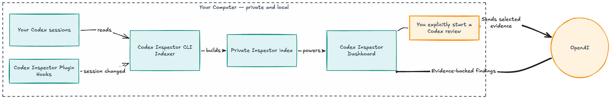

# Codex Inspector

**[OpenAI Build Week 2026](https://openai.devpost.com/) · Developer Tools**

**See how you use Codex, understand what happened, and improve what happens
next.**

Codex Inspector gives people who use Codex heavily a clear view into how they
work. It turns the Codex sessions already on your Mac into a dashboard where
you can explore usage, investigate individual sessions, and ask Codex for
evidence-backed advice about your workflow.

Your session history and Inspector data stay on your machine. There is no
account, cloud dashboard, remote database, or sample data to configure.

> [insert screenshot of the Token & Capacity dashboard here]
>
> _Synthetic data shown. No private Codex history is included._

> [!NOTE]
> The current release supports **macOS on Apple Silicon** and Codex CLI/host
> `0.142.5` or newer. See the [support matrix](docs/contracts/support-matrix.md)
> for exact compatibility details.

## From session logs to an actionable answer

Without Inspector, answering “where did my Codex capacity go?” means searching
session files, connecting spawned-agent work by hand, reconstructing what
happened turn by turn, and finding the original evidence behind a suspected
problem.

With Inspector, you can start with usage across all sessions, open the session
responsible for that activity, separate main-session work from delegated work,
inspect the exact turn and events, and start a GPT-5.6 review whose findings
link back to that evidence.

## Questions Inspector helps you answer

- Where are my Codex tokens and available capacity going?
- Which projects and sessions account for the most activity?
- How much work happened in my main session, and how much was delegated to
  other agents?
- What did Codex actually do during a session or turn?
- Where did a session get stuck, repeat work, or accumulate too much context?
- What am I doing well, and what should I try differently next time?

Inspector connects every summary and recommendation back to the recorded
session evidence behind it. It does not reduce your work to a single quality or
efficiency score.

## Why Inspector is different

- **More than token accounting:** Usage leads directly to the sessions, turns,
  agents, and original evidence behind it.
- **Facts before judgment:** Normal indexing is local and repeatable. Reviews
  use a model only when you explicitly start one.
- **Advice you can verify:** Review findings cite recorded events instead of
  hiding their reasoning behind an opaque score.

## What you can do

### Understand your usage

See token use over time, the latest capacity readings recorded by Codex, and
the sessions that contributed the most. Work done by the main session and by
spawned agents is shown separately.

### Investigate a session

Search your sessions, follow work into spawned agents, and replay a turn in the
order it happened. You can inspect messages, tool calls, patches, searches,
context compactions, and token records without digging through log files.

> [insert screenshot of Context Inspector with a selected turn here]
>
> _Synthetic data shown. No private Codex history is included._

### Improve your workflow

Start an Effectiveness Review for one session or a recent period. Codex looks
at task framing, execution, delegation, and opportunities to turn repeated work
into reusable guidance or automation. Each finding cites the local evidence
that supports it and suggests a concrete next step.

> [insert screenshot of a completed GPT-5.6 Effectiveness Review here]
>
> _Synthetic data shown. No private Codex history is included._

## How it works

Codex Inspector has three parts:

1. **The Codex plugin** connects Inspector to your Codex workflow. Its hooks
   leave small signals when sessions change, and its bundled skills help you
   open Inspector, jump to the current session, and run reviews.
2. **The local CLI** reads your existing Codex history and builds a private,
   rebuildable index on your Mac. It never rewrites your Codex sessions.
3. **The local dashboard** turns that index into usage views, session traces,
   and review reports in your browser.



Normal indexing is local and deterministic. A review is different: it is an
explicit Codex task and may send the evidence it reads to your configured Codex
model service. Opening the dashboard never starts a review.

## Built with Codex and GPT-5.6

Codex Inspector is an OpenAI Build Week project in the Developer Tools track.
We used Codex throughout product discovery, design, implementation, and
verification:

- An initial brainstorming and grilling session challenged the target
  audience, product promise, privacy boundary, evidence standard, technical
  shape, and must-ship scope.
- Codex helped turn those decisions into the local-first architecture and the
  connected Token & Capacity, Context Inspector, and Effectiveness Reviews
  experience.
- We used Codex to implement and test the indexer, dashboard, plugin, review
  workflow, compatibility checks, and clean-install path.
- Browser-driven design reviews helped us improve the working interface through
  repeated implementation and verification passes.

GPT-5.6 Sol at high reasoning helped shape the initial product direction and
the Effectiveness Reviews experience. GPT-5.6 is also part of the finished
product: reviews use Sol by default, offer Terra and Luna, and start a persisted
Codex task with the model and reasoning level selected by the user. Each review
is bounded to the chosen work, and its findings must cite evidence that
Inspector can resolve back to the recorded session.

Codex accelerated the work, but the team made the final product, design, scope,
privacy, and release decisions. The original
[Build Week plan](docs/plans/build-week-plan.md),
[dashboard exploration](docs/brainstorming/codex-home-dashboard-metrics.md),
[session-map exploration](docs/brainstorming/context-inspector-session-map.md),
and [review exploration](docs/brainstorming/codex-effectiveness-reviews.md)
preserve the decisions and tradeoffs that shaped the project.

## Install

The easiest path is to install the plugin first, then let Codex install and
verify the local CLI.

### 1. Install the plugin

In a terminal, run:

```sh
codex plugin marketplace add "dylanjbarth/codex-inspector@v0.1.1"
codex plugin add codex-inspector@codex-inspector-development
```

Start a new Codex session. When Codex asks you to review the plugin hooks,
confirm that all seven Inspector hooks run `inspector-hook.sh`, then choose
**Trust all and continue**.

### 2. Ask Codex to open Inspector

In the new session, enter:

```text
Open Codex Inspector.
```

You can explicitly select the bundled skill if needed:

```text
Use $codex-inspector:open-dashboard to open Codex Inspector.
```

If the local CLI is missing, Codex will explain what it plans to install and
ask for approval before downloading anything. It checks that your Mac is
supported, verifies the published download, installs the CLI without `sudo`,
runs a health check, and opens the dashboard.

That is the complete setup. Inspector begins with your recent sessions and
continues through older supported history in the background.

<details>
<summary>Prefer to install the CLI yourself?</summary>

Download the binary and checksum from the supported
[`v0.1.1` release](https://github.com/dylanjbarth/codex-inspector/releases/tag/v0.1.1),
verify the checksum, and place `codex-inspector` in a user-writable directory on
your `PATH`. The repository also contains an auditable
[`install.sh`](install.sh) that performs those steps without `sudo` or shell
profile changes.

Then verify and open Inspector:

```sh
codex-inspector doctor
codex-inspector open
```

</details>

## Use Inspector

Most people can work entirely from the dashboard:

1. Open **Token & Capacity** to see where your usage went.
2. Choose a contributing session and investigate it in **Context Inspector**.
3. Select **Review effectiveness** when you want Codex to analyze that work.
4. Follow a report citation back to the exact recorded evidence.

You can also ask Codex to use the bundled skills:

```text
Use $codex-inspector:open-dashboard to open Codex Inspector.
Use $codex-inspector:inspect-session to inspect this session.
```

For direct terminal control:

```sh
codex-inspector open              # open or reconnect to the dashboard
codex-inspector status            # show server, indexing, and hook health
codex-inspector sync --background # look for new session data
codex-inspector stop              # stop the local server
```

## Privacy and trust

- Inspector reads your Codex session history but never rewrites it.
- Its index, reports, and process data stay under `~/.codex-inspector` by
  default.
- The dashboard is served only on your computer.
- Exact evidence may contain prompts, source code, tool inputs and outputs,
  credentials, or personal data. Treat screenshots and copied evidence as
  sensitive; Inspector does not mask secrets.
- Reviews run only when you explicitly start them. Inspector never applies a
  recommendation or changes your projects automatically.
- If the index is removed or damaged, Inspector can rebuild it from the source
  sessions that are still available.

## Current limitations

The current release does not support Intel Macs, Linux, or Windows. It does not
stream incomplete turns, reconstruct context that Codex did not record, or
guarantee that evidence remains available after its source session is deleted.

For exact coverage and known format constraints, see the
[support matrix](docs/contracts/support-matrix.md).

## Development

Release binaries are the recommended user path. To build the current checkout,
install Go `1.26.0`, Node.js `20` or newer, and pnpm `10.28.0`, then run:

```sh
pnpm install --frozen-lockfile
codex plugin marketplace add "$PWD"
codex plugin add codex-inspector@codex-inspector-development
scripts/dev-rebuild-restart.sh
```

Restart Codex after adding the local plugin, review and trust its seven hooks,
and run the project checks with:

```sh
go test ./...
pnpm test
pnpm lint
pnpm typecheck
pnpm build
```

The [demo runbook](docs/demo-runbook.md) covers the complete release flow. The
[MVP architecture](docs/architecture/mvp-architecture.md) is the implementation
reference.
