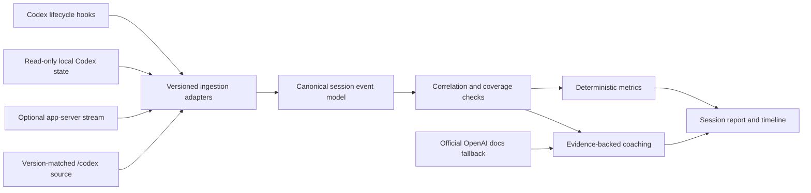

# Codex Observability

> Product record and collaboration log for a local Codex observability and coaching plugin.

## Project status

Version 0.2 is implemented as a personal, local-first plugin. It includes a validated manifest, one bundled analysis skill, a source-version contract, an incremental sanitized history cache, deterministic coaching, responsive bento dashboards, self-contained session reports, telescope assets, and synthetic integration tests. It intentionally has no hooks, MCP server, app connector, cloud sync, model-generated grading, or third-party runtime dependency.

The concrete, gated implementation process is documented in [PLUGIN_BUILD_PROCESS.md](./PLUGIN_BUILD_PROCESS.md).

The product name is **Codex Observability** and the plugin ID is `codex-observability`. The implementation source is in [codex-observability](./codex-observability/).

## The idea

I want to build a Codex plugin for engineers, developers, and power users who want to understand how they are using Codex and how Codex is operating during each session.

The plugin should answer two related questions:

1. **What happened?** Show a granular, chronological, evidence-backed view of the session: turns, tools, skills, permissions, sandbox decisions, token usage, failures, retries, file changes, subagents, compaction, and verification work.
2. **How can the next session be better?** Review the observable workflow and offer a small number of specific, source-backed suggestions that help the user prompt, configure, guide, and verify Codex more effectively.

The goal is not merely a usage dashboard. It is a local-first observability layer and a personal learning loop for Codex.

## Decisions I made

I established the product direction and the constraints that shape the design:

- The primary audience is engineers, developers, and power users.
- Analysis happens at session and turn level, not only as account-wide totals.
- The plugin should expose highly granular operational data, including tool and skill use.
- Every completed session should be an opportunity to teach the user a better Codex practice.
- The local `/codex` source checkout is the ground truth for Codex behavior and data contracts.
- Official OpenAI documentation is a fallback when the source does not resolve a question.
- Implementation begins only after the research produces a decision-complete, source-grounded plan.
- Historical coaching must separate top-level tasks, spawned subagents, and internal review agents.
- The dashboard should lead with a green “What you did well” card and a constructive red “What to improve” card.
- Dense operational data should use a balanced bento layout and progressive disclosure.

These are product decisions, not model-generated assumptions. Codex helped turn them into an architecture, a data model, explicit safety boundaries, and a staged research plan.

## Source-of-truth policy

The plugin should label every claim by provenance rather than presenting all findings with the same certainty.

| Priority | Source | What it can establish |
| --- | --- | --- |
| 1 | A version-matched `/codex` source checkout | Event definitions, lifecycle behavior, schemas, feature gates, and implementation semantics |
| 2 | The user's local Codex runtime data | What was actually recorded for a particular session and installed Codex version |
| 3 | Official OpenAI Codex documentation | Supported product behavior, public contracts, recommended practices, and gaps not resolved from source |
| 4 | Plugin analysis | Derived metrics, heuristics, and coaching recommendations, always labeled as interpretation |

Each report should record the installed Codex version, source commit, schema or adapter version, coverage, parse warnings, and any mismatch between the runtime and `/codex` checkout. A mismatch should produce an explicit **unsupported or partially supported** result rather than silent extrapolation.

### Current research constraint

As of July 16, 2026, there is no absolute `/codex` source checkout on this machine. `/Users/luisgonzalez/Documents/codex` exists, but it is a dated Codex task archive rather than the OpenAI Codex source repository. I chose not to treat that directory as a substitute.

Codex attempted the approved clone into literal `/codex`, but macOS rejected the operation because the root filesystem is read-only. Implementation and acceptance testing used a temporary official checkout pinned to `rust-v0.143.0` at commit `c4d748f586a84a3ed5b6aceb82e9a1db4abb1cda`. The shipped analyzer still defaults to `/codex`, accepts the explicit `--source-root` override, and fails closed on a version or commit mismatch.

## Product principles

### Evidence before advice

Every metric and recommendation should link back to the session events that support it. If the plugin cannot observe something, it should say so.

### Observable behavior, not private reasoning

“Under the hood” means observable operational behavior: tool calls, event timing, permissions, skills, context changes, outputs, failures, and artifacts. It does not mean exposing private chain-of-thought. Reasoning summaries or metadata may be reported only when Codex deliberately exposes them through a supported interface.

### Local-first and private by default

Raw sessions can contain prompts, source code, shell output, paths, credentials, and customer data. The default report should use metadata and redacted excerpts. Full-content analysis should require explicit opt-in.

### Precise, not judgmental

The plugin should avoid vague grades such as “bad prompt.” It should explain the observed friction, its likely impact, and a concrete improvement. Recommendations should be dismissible so the system can learn what is useful to that user.

### Version-aware by design

Codex event formats and capabilities can change. Parsers should be adapters keyed to Codex version and source commit, backed by fixtures generated from that version.

## Recommended product experience

### 1. Session summary

Lead with the outcome:

- What the user asked Codex to accomplish
- Whether the task appears completed, interrupted, failed, or uncertain
- Files or external systems affected
- Verification Codex performed
- Important warnings, approvals, or unsupported data

### 2. Interactive timeline

Show turns and operations in order. Each timeline span should include the event type, start and end time when available, duration, status, parent turn, tool or skill name, approval state, and a link to safely redacted evidence.

Useful filters include:

- User messages and steering
- Agent messages
- Tool calls and outputs
- Skills
- Shell commands and patches
- MCP and app calls
- Web searches
- Permissions and sandbox escalations
- Subagents
- Plan updates
- Compaction and context events
- Errors, retries, and cancellations
- Token usage

### 3. Session report

The report should separate facts from interpretation:

- **Observed:** Directly present in a supported event or local database field.
- **Correlated:** Joined across sources using stable identifiers.
- **Inferred:** A plugin heuristic with an explanation and confidence level.
- **Unavailable:** Not captured, redacted, or unsupported for this Codex version.

### 4. Coaching card

End with no more than three high-value suggestions. Each suggestion should include:

- The observed pattern
- Why it may matter
- A concrete change for the next session
- The supporting event or events
- Confidence and applicability
- A way to dismiss, snooze, or convert the suggestion into reusable guidance

Examples of useful next actions include improving the next prompt, updating `AGENTS.md`, creating or refining a skill, choosing Plan mode, tightening permissions, adding a verification command, or turning a stable workflow into an automation.

## Recommended technical shape

The best current design is a hybrid rather than a parser tied to one private file format.

### Capture layer

Use three complementary inputs:

1. **Plugin-bundled lifecycle hooks** for trusted, real-time envelopes around session starts, prompts, tool use, permission requests, compaction, subagents, and session stops. Hooks are useful for live capture but require user review and trust.
2. **Read-only local import** from Codex state and rollout files for historical sessions, reconciliation, token totals, and recovery when a hook was disabled or missed an event.
3. **Optional Codex app-server mode** for users who want a rich live client built on streamed thread, turn, and item events. Schemas should be generated for the exact installed Codex version.

The transcript path supplied to hooks should not be treated as a stable API. Current official guidance explicitly warns that transcript format may change. It can be an input to a versioned adapter, not the canonical contract.

### Normalization layer

Normalize all supported inputs into a small canonical model:

| Entity | Purpose | Example fields |
| --- | --- | --- |
| Session | One Codex conversation | session ID, source, version, model, workspace, start and end state |
| Turn | One user request and the resulting work | turn ID, parent session, input mode, status, usage, completion signal |
| Event | An immutable observed record | event ID, timestamp, source, raw type, provenance, redaction state |
| Span | A correlated operation with duration | tool, skill, approval, subagent, compaction, start, end, status |
| Artifact | A referenced result | file change, diff, generated asset, report, external action |
| Evidence | A source pointer supporting a claim | source type, version, record locator, confidence |
| Recommendation | A coaching suggestion | rule ID, evidence IDs, impact, action, confidence, user feedback |
| Coverage | What the plugin could and could not see | supported events, missing records, parser warnings, source mismatch |

Preserve the raw event type and parser version even after normalization. This makes future migrations and audits possible.

### Storage layer

Store normalized and redacted data in the plugin's writable data directory. Keep raw content out of the normalized database by default. Recommended retention modes are:

- Metadata only
- Redacted content
- Full local content with explicit opt-in
- Ephemeral report with no retained session data

The user should be able to inspect, export, and delete the plugin's data without deleting the original Codex session.

### Analysis layer

Start with deterministic rules and transparent formulas. Add model-assisted synthesis only after the factual report is complete.

Candidate metrics include:

- Tool calls by type, status, duration, and turn
- Tool failure, retry, and recovery patterns
- Approval requests and sandbox escalations
- File reads, writes, patches, and verification activity
- MCP, app, browser, web, and computer-use activity
- Skills explicitly invoked, activated, and actually read
- Plans created and updated
- Subagent starts, stops, and outcomes
- Context compactions and token growth
- Input, cached input, output, reasoning-output, and total tokens when available
- Time to first tool, time to first useful result, and end-to-end duration when timestamps support them
- Whether tests, builds, linters, reviews, or other requested completion checks ran
- Unsupported, malformed, missing, or contradictory records

Token events must be treated as cumulative snapshots where the source defines them that way. Summing every snapshot would double-count usage.

Cost should not be estimated unless the plugin has a versioned, cited price source and can prove which tokens are billable. Token counts and cost are different metrics.

### Recommendation layer

The coaching engine should use a rule registry with versioned evidence requirements. Possible recommendation families include:

- **Prompt clarity:** Suggest goal, context, constraints, output, or “done when” criteria only when missing context caused observable churn or uncertainty.
- **Planning:** Suggest Plan mode for genuinely complex or ambiguous work, not for every long session.
- **Durable guidance:** Suggest `AGENTS.md` when the same repository convention or correction recurs.
- **Reusable workflows:** Suggest a skill when a stable sequence is repeated across sessions.
- **Tool selection:** Surface avoidable retries or a mismatch between the task and the selected tool or surface.
- **Verification:** Point out when Codex changed something but did not run an available, relevant check.
- **Safety:** Highlight unnecessarily broad permissions, secret exposure, or side effects lacking clear confirmation.
- **Efficiency:** Identify repeated reads, failing commands, redundant tool calls, or excessive context churn without equating token volume with poor work.

Recommendations should optimize for precision over volume. A quiet report is better than generic advice.

## Skill observability is a special research problem

Tool calls have explicit runtime representations, but skill use can be less direct. A session may contain an available-skill catalog, an explicit user invocation, a model-selected skill, a read of `SKILL.md`, and subsequent adherence to its workflow. Those are different facts.

The plugin should not collapse them into a single “skill used” boolean. A useful state model is:

- Available to the session
- Explicitly requested by the user
- Selected or announced by Codex
- Instructions loaded
- Referenced resources loaded
- Workflow actions observed
- Completion requirements satisfied

The 0.143.0 source proves that Codex detects some implicit skill use by recognizing reads of skill instructions or executions of known skill scripts. It forwards that detection to extension contributors and analytics. The current research did not establish an equivalent stable, user-owned rollout event that the offline importer can always consume.

Therefore, availability, explicit request, instruction loading, implicit detection, and workflow adherence remain separate states. Anything not persisted in a supported local event should be labeled as inferred. If no reliable user-visible invocation event exists, the product should propose an upstream event rather than relying permanently on fragile file-read heuristics.

## Privacy and security boundaries

The plugin will process unusually sensitive developer data. The initial release should be local-only and make no network requests for session analysis.

Required safeguards:

- Never print or persist authentication files, secret values, raw environment variables, or unredacted command payloads by default.
- Redact likely credentials before storage, indexing, logging, or model-assisted analysis.
- Treat prompts, responses, shell output, diffs, browser data, connector results, memories, and logs as sensitive.
- Keep local Codex databases read-only and report reconciliation gaps.
- Show exactly which files and directories were inspected.
- Do not silently upload telemetry.
- Separate content access from metadata access in permissions and settings.
- Make retention, export, and deletion controls understandable.
- Require trust review for plugin-bundled hooks and explain what each hook records.
- Avoid using diagnostic log bodies as a primary source when safer structured sources exist.

## What the initial plugin should not claim

- It cannot reveal private chain-of-thought.
- It cannot prove user satisfaction from tool counts or token totals.
- It cannot infer task quality from session length alone.
- It cannot promise stable parsing of undocumented transcript formats.
- It cannot attribute a tool call to a skill without direct evidence or a labeled inference.
- It cannot calculate money saved, productivity gained, or model cost without defensible inputs.
- It cannot claim full coverage when hooks were disabled, data was deleted, or source and runtime versions differ.

## Implemented plugin package

The implemented v0.2 package includes:

- A required `.codex-plugin/plugin.json` manifest
- One skill for historical and selected-session analysis
- Standard-library scripts for read-only ingestion, incremental sanitized caching, coaching, and rendering
- A responsive all-history bento dashboard plus granular session reports
- Fixtures and source references keyed to Codex version
- A versioned coaching policy backed by official model and subagent guidance

The plugin uses vanilla HTML, CSS, JavaScript, and SVG. Hooks, an MCP server, and an app-server client remain deferred until the offline product proves that additional capture is necessary.

## MVP proposal

### Phase 0: Source research

- Make the real OpenAI Codex checkout available at `/codex`.
- Record its commit and match it to the installed `codex-cli` version.
- Locate the canonical definitions for session, turn, item, tool, hook, token, skill, approval, compaction, and subagent events.
- Generate app-server schemas for that exact version.
- Build a field-level source map before writing a parser.
- Decide which event surfaces are stable contracts and which need adapters.

### Phase 1: Read-only session report

- Analyze one selected local session.
- Produce a redacted, self-contained HTML timeline and coverage report.
- Reconcile exact total tokens with the final cumulative rollout breakdown.
- Report tool calls, errors, retries, approvals, and verification activity.
- Offer at most three deterministic coaching suggestions.
- Retain nothing unless the user opts in.

### Phase 2: Trusted live capture

- Add plugin-bundled hooks.
- Correlate hook envelopes with historical state.
- Capture timing and failure data without storing raw arguments by default.
- Add explicit states for skill availability, selection, loading, and adherence where supported.

### Phase 3: Learning loop

- Compare sessions within the same workspace and task family.
- Let users rate, dismiss, or promote recommendations.
- Detect repeated friction before suggesting `AGENTS.md`, a skill, a configuration change, or an automation.
- Measure recommendation acceptance and false-positive rates rather than inventing a single productivity score.

### Phase 4: Rich observability

- Add an optional live app-server client and interactive timeline.
- Support version-to-version schema migrations.
- Add team-safe aggregate reports that cannot reconstruct individual content.
- Evaluate enterprise export paths only after privacy and governance review.

## Research questions to answer before coding

1. Where will the version-matched `/codex` checkout live, and how will it be updated safely?
2. Which Codex surfaces must the first release support: desktop app, CLI, IDE, cloud, or only local sessions?
3. Should the MVP analyze only the current session or let users browse all local sessions?
4. Is metadata-only the required default, or may redacted prompt and response excerpts appear?
5. What retention mode should be the default?
6. Which hook fields are stable in the target source version?
7. Is there a first-class skill activation event? If not, what upstream event is needed?
8. Can tool durations be derived reliably across hooks, rollouts, and app-server events?
9. How should interrupted, forked, compacted, and subagent sessions be joined?
10. Which coaching rules are valuable enough to ship, and what evidence prevents false positives?
11. Should recommendations be personalized only on-device, or can users explicitly export a profile?
12. Is a local MCP server necessary for the MVP, or is a skill plus scripts and hooks sufficient?

The implemented defaults are: CLI 0.143.0 only, redacted details by default, all retained sessions analyzed on demand, a sanitized incremental local cache, self-contained bento HTML, deterministic coaching, optional hooks later, and no MCP server or app-server client in v0.2.

## My collaboration with Codex

I used Codex first as a research partner and then as an implementation partner after approving the source-grounded plan.

I supplied the product vision, target users, observability goal, educational loop, source hierarchy, and the explicit instruction not to write code. I also required the project record to distinguish where my decisions ended and Codex's contribution began.

Codex accelerated the workflow by:

- Turning a broad idea into a concrete product contract and staged roadmap
- Inspecting the current plugin, hook, app-server, and session-data guidance
- Verifying the actual local Codex data sources instead of assuming a schema
- Running a privacy-preserving audit to confirm that thread metadata, cumulative token totals, rollout breakdowns, models, workspaces, and session inventories can be reconciled locally
- Dogfooding the concept against this very Codex session and inspecting event shapes without printing prompt contents, response contents, tool arguments, or secrets
- Finding the critical `/codex` path mismatch before it became an engineering assumption
- Separating supported facts, correlations, inferences, and unavailable data
- Identifying skill observability, transcript instability, source-version matching, and recommendation quality as the highest-risk research areas
- Converting the approved design into a dependency-free parser, incremental cache, coaching engine, bento UI, privacy fixtures, and local plugin package
- Testing the same inputs twice to prove deterministic output and cache reuse

I made the core product, engineering, and design decisions: local-first operation, `/codex` source authority, prompt-free historical analysis, two coaching cards, constructive language, model/task guidance, subagent boundaries, and the bento layout. GPT-5.6 and Codex helped me test those decisions against current evidence, expose edge cases, compare capture strategies, implement the approved design, and verify the result.

The current task was recorded locally as a GPT-5.6-family Codex session. GPT-5.6 contributed the synthesis and critique; Codex contributed the operating environment, local inspection tools, source-aware workflows, and the ability to verify claims against the machine's real session data. Neither replaced my role as product owner. I chose the goals, constraints, and definition of trustworthy behavior.

Codex first respected the boundary between research and implementation, then implemented only after I explicitly approved the decision-complete plan. GPT-5.6 helped synthesize the coaching model and challenge overbroad claims—for example, distinguishing Luna-friendly repeatable extraction from Terra-friendly exploratory reading instead of labeling every read task the same. Codex supplied the operating environment, source inspection, local audit, implementation tools, test loop, visual verification workflow, and plugin packaging. The resulting codebase is source-pinned, privacy-tested, dependency-light, locally installed, and accompanied by the collaboration and design record in this README.

## How this collaboration should continue

The next collaboration should focus on real-world report feedback, support for the next Codex CLI version, stronger tool-family correlation, and whether automatic hooks are valuable enough for a future release. I continue to own product priorities, acceptable data collection, recommendation behavior, and release criteria.

## Research references

- [Build Codex plugins](https://learn.chatgpt.com/docs/build-plugins)
- [Codex lifecycle hooks](https://learn.chatgpt.com/docs/hooks)
- [Codex app-server](https://learn.chatgpt.com/docs/app-server)
- [Codex skills](https://learn.chatgpt.com/docs/build-skills)
- [Codex best practices](https://learn.chatgpt.com/guides/best-practices)
- [Recommended Codex models](https://learn.chatgpt.com/docs/models#recommended-models)
- [Codex subagents](https://learn.chatgpt.com/docs/agent-configuration/subagents)
- [OpenAI Codex source repository](https://github.com/openai/codex)
- [Codex 0.143.0 source tag](https://github.com/openai/codex/tree/rust-v0.143.0)

These references are secondary to a version-matched `/codex` checkout for implementation details. They are included to make the research trail reviewable.
